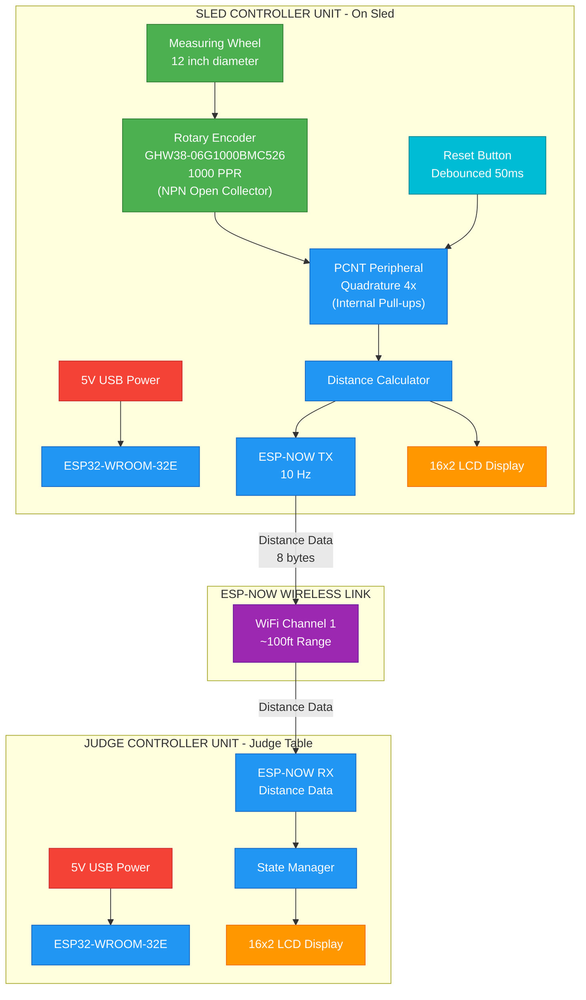

# SledLink System Diagram

## Tractor Pull Distance Measurement System

## Component Legend

| Color | Component Type |
|-------|----------------|
| Blue | ESP32 / Processing |
| Green | Sensors |
| Orange | Displays |
| Red | Power |
| Purple | Wireless |
| Cyan | User Input |

## Data Flow Summary

- **Sled to Judge**: Distance packets (float + timestamp, 8 bytes) transmitted at 10 Hz
- **Reset**: Performed locally on sled controller via reset button